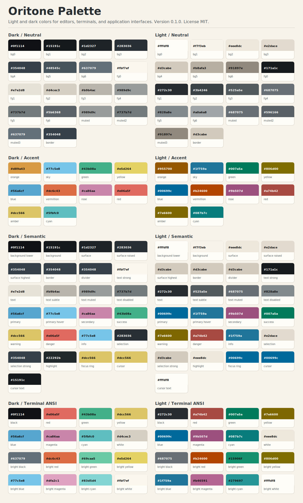
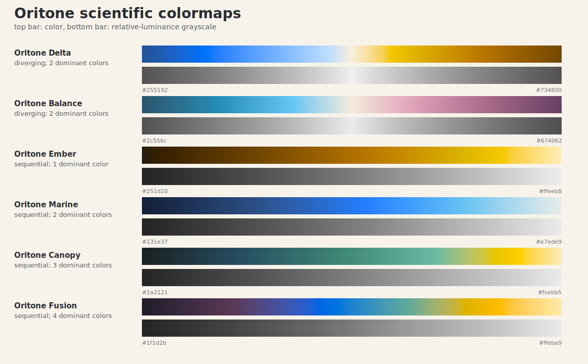
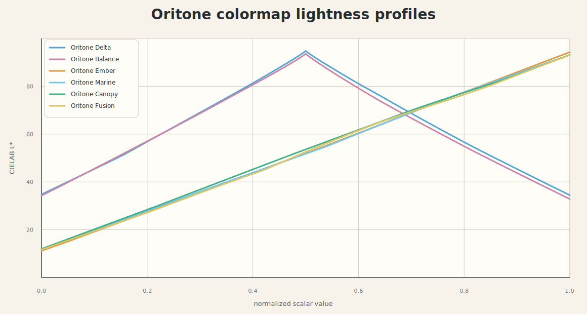

# Oritone

Oritone is a mature light/dark color theme for editors, terminals, application
interfaces, and scientific visualization.

- Version: `0.1.0`
- License: MIT
- Reference: Okabe & Ito color-blind-friendly palette, used as a color
  direction source only: <https://siegal.bio.nyu.edu/color-palette/>

The theme name, install names, palette exports, and colormap exports are all
`oritone`.

## Visual Preview

### Theme Palette

<picture>
  <source media="(prefers-color-scheme: dark)" srcset="palette/oritone-palette-dark.svg">
  <source media="(prefers-color-scheme: light)" srcset="palette/oritone-palette-light.svg">
  
</picture>

For the browser preview with responsive HTML/CSS cards, open
[`palette/oritone-palette.html`](palette/oritone-palette.html).

### Scientific Colormaps

<picture>
  <source media="(prefers-color-scheme: dark)" srcset="colormaps/previews/oritone-colormaps-preview-dark.svg">
  <source media="(prefers-color-scheme: light)" srcset="colormaps/previews/oritone-colormaps-preview-light.svg">
  
</picture>

<picture>
  <source media="(prefers-color-scheme: dark)" srcset="colormaps/previews/oritone-colormaps-lightness-dark.svg">
  <source media="(prefers-color-scheme: light)" srcset="colormaps/previews/oritone-colormaps-lightness-light.svg">
  
</picture>

For the browser colormap preview, open
[`colormaps/oritone-colormaps.html`](colormaps/oritone-colormaps.html).

## Theme Palette

The theme palette is split into dark and light variants. Each variant contains:

- `neutral`: base background, foreground, muted, and border ramps.
- `accent`: named colors derived from the Okabe & Ito color direction and tuned
  for Oritone.
- `semantic`: UI role tokens such as background, surface, primary, success,
  warning, danger, selection, focus ring, cursor, and text levels.
- `terminal`: terminal foreground/background/cursor values and a full ANSI 16
  color map.

Use `palette/oritone-palette.json` or `palette/oritone-design-tokens.json` for
machine-readable integration. Use the CSS or SCSS exports for application UI,
and the GPL or ASE exports for design tools that support palette imports.

## Scientific Colormaps

Oritone includes six continuous scientific colormaps. Sequential maps are for
positive-only or ordered scalar fields. Diverging maps are for data with a
meaningful center such as zero, a baseline, or a signed residual.

| Name | Type | Dominant colors | Best use |
| --- | --- | ---: | --- |
| Oritone Delta | Diverging | 2 | Signed anomalies, residuals, and centered scalar fields. |
| Oritone Balance | Diverging | 2 | Signed pressure, displacement, uncertainty difference, or centered normalized quantities. |
| Oritone Ember | Sequential | 1 | Scalar intensity, energy, heat, flux, or positive-only quantities. |
| Oritone Marine | Sequential | 2 | Depth, density, concentration, velocity magnitude, or cool scalar fields. |
| Oritone Canopy | Sequential | 3 | Ecology, terrain overlays, material fraction, and positive-valued simulation results. |
| Oritone Fusion | Sequential | 4 | General-purpose scalar fields with broad dynamic range. |

The ramps are generated in OKLab with controlled lightness profiles and
gamut-safe chroma reduction, then exported as dense RGB point presets.
Diverging maps use 257 samples so the center has an exact sample. Sequential
maps use 256 samples. `NanColor` is set to a muted Oritone gray, and
below/above-range colors are set to the ramp endpoints.

### ParaView

Use the combined preset file:

```text
colormaps/paraview/oritone-colormaps.json
```

In ParaView, open **View -> Color Map Editor**, click **Presets**, then
**Import**, and select the JSON preset file. A legacy XML export is also
available at:

```text
colormaps/paraview/oritone-colormaps.xml
```

Individual JSON and XML presets are provided under `colormaps/json/` and
`colormaps/xml/`.

### Matplotlib

From the repository root, use the helper module to register all Oritone
colormaps:

```python
from colormaps.oritone_colormaps import register_oritone_colormaps

register_oritone_colormaps()

# Then use names such as "oritone-fusion" or "oritone-delta".
```

## Terminal and Editor Themes

### Ghostty

Copy the Ghostty themes:

```sh
mkdir -p ~/.config/ghostty/themes
cp ghostty/oritone-* ~/.config/ghostty/themes/
```

Use one theme directly in `~/.config/ghostty/config.ghostty`:

```ini
theme = oritone-dark
```

Or use Ghostty light/dark theme selection:

```ini
theme = light:oritone-light,dark:oritone-dark
```

Ghostty also supports the legacy config filename
`~/.config/ghostty/config`. Reload the configuration after copying or changing
the theme.

### Helix

Copy the Helix themes:

```sh
mkdir -p ~/.config/helix/themes
cp helix/oritone_*.toml ~/.config/helix/themes/
```

Use one theme directly:

```toml
theme = "oritone_dark"
```

Or use Helix light/dark theme selection:

```toml
[theme]
dark = "oritone_dark"
light = "oritone_light"
fallback = "oritone_dark"
```

Transparent variants are also included:

```toml
[theme]
dark = "oritone_dark_transparent"
light = "oritone_light_transparent"
fallback = "oritone_dark_transparent"
```

The transparent variants unset full-screen editor backgrounds so the terminal
emulator's own background, opacity, or wallpaper can show through. Menus,
popups, statusline, selections, and cursor accents remain solid for readability.

### TextMate-Compatible Themes

The `codex/` directory contains XML `.tmTheme` files:

```text
codex/oritone-dark.tmTheme
codex/oritone-light.tmTheme
```

Use these with TextMate-compatible consumers that accept `.tmTheme` files. The
themes define global editor colors, common syntax scopes, markup scopes, search
and selection colors, gutter colors, bracket colors, and diff-related styling.

## CSS Variables

Import the CSS export and use the generated custom properties:

```css
@import "./palette/oritone-palette.css";

.panel {
  color: var(--oritone-dark-text);
  background: var(--oritone-dark-surface);
  border-color: var(--oritone-dark-border);
}
```

Variable names follow this pattern:

```text
--oritone-{mode}-{token}
--oritone-{mode}-terminal-{token}
--oritone-{mode}-ansi-{token}
```

Examples:

```text
--oritone-dark-background
--oritone-dark-primary
--oritone-dark-ansi-bright-blue
--oritone-light-background
--oritone-light-primary
--oritone-light-ansi-bright-blue
```

## Exports

### Palette Exports

| File | Purpose |
| --- | --- |
| `palette/oritone-palette.json` | General-purpose JSON palette data. |
| `palette/oritone-design-tokens.json` | Design Tokens Community Group style color tokens. |
| `palette/oritone-palette.css` | CSS custom properties. |
| `palette/oritone-palette.scss` | SCSS variables. |
| `palette/oritone-palette.toml` | TOML export for tools that prefer TOML. |
| `palette/oritone-palette.gpl` | GIMP/Inkscape palette import. |
| `palette/oritone-palette.ase` | Adobe Swatch Exchange palette import. |
| `palette/oritone-palette.html` | Browser palette preview. |
| `palette/oritone-palette-dark.svg` | Dark GitHub theme vector palette preview. |
| `palette/oritone-palette-light.svg` | Light GitHub theme vector palette preview. |

### Colormap Exports

| File | Purpose |
| --- | --- |
| `colormaps/paraview/oritone-colormaps.json` | Combined ParaView JSON preset. |
| `colormaps/paraview/oritone-colormaps.xml` | Combined legacy ParaView XML preset. |
| `colormaps/json/*.json` | Individual JSON presets. |
| `colormaps/xml/*.xml` | Individual XML presets. |
| `colormaps/csv/*.csv` | Normalized scalar value plus RGB float and hex. |
| `colormaps/txt/*.txt` | 8-bit RGB triplets and hex. |
| `colormaps/png/*.png` | Individual horizontal ramp strips. |
| `colormaps/previews/*.svg` | Theme-aware vector previews for README rendering. |
| `colormaps/previews/*.png` | PNG composite previews, lightness profiles, and synthetic-field examples. |
| `colormaps/oritone_colormaps.py` | Matplotlib registration helper. |
| `colormaps/oritone-colormaps-metadata.json` | Diagnostics and intended-use metadata. |
| `colormaps/oritone-colormaps.html` | Browser colormap preview. |

## Repository Layout

```text
codex/
  oritone-dark.tmTheme
  oritone-light.tmTheme
colormaps/
  csv/
  json/
  paraview/
  png/
  previews/
  txt/
  xml/
  oritone-colormaps.html
  oritone-colormaps-metadata.json
  oritone_colormaps.py
ghostty/
  oritone-dark
  oritone-light
helix/
  oritone_dark.toml
  oritone_light.toml
  oritone_dark_transparent.toml
  oritone_light_transparent.toml
palette/
  oritone-design-tokens.json
  oritone-palette.ase
  oritone-palette.css
  oritone-palette.gpl
  oritone-palette.html
  oritone-palette.json
  oritone-palette.scss
  oritone-palette-dark.svg
  oritone-palette-light.svg
  oritone-palette.toml
LICENSE
README.md
```

## License

Oritone is MIT licensed. See [`LICENSE`](LICENSE).
